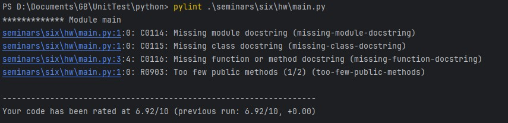
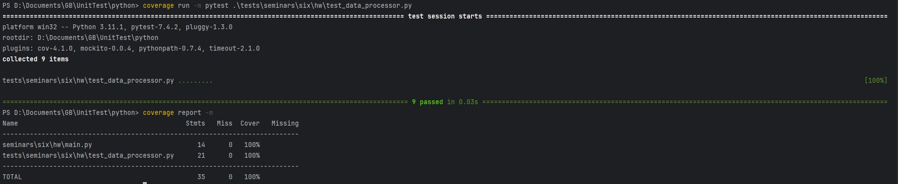

**Задание 1. Создайте программу на Python или Java, которая принимает два списка чисел и выполняет следующие действия:**

1. Рассчитывает среднее значение каждого списка.
2. Сравнивает эти средние значения и выводит соответствующее сообщение:

- "Первый список имеет большее среднее значение", если среднее значение первого списка больше.
- "Второй список имеет большее среднее значение", если среднее значение второго списка больше.
- "Средние значения равны", если средние значения списков равны.

**Тесты:**

```test_valid_args``` - параметризованный тест с различными вариантами позитивных сценариев

```test_arg_not_list``` - параметризованный тест c негативным сценарием, проверяется поведение, если передан не список

```test_item_list_not_numeric``` - параметризованный тест c негативным сценарием, проверяется поведение, если среди
элементов переданных списков встречаются не числа

**Отчет pylint**



**Отчет о покрытии кода тестами**

